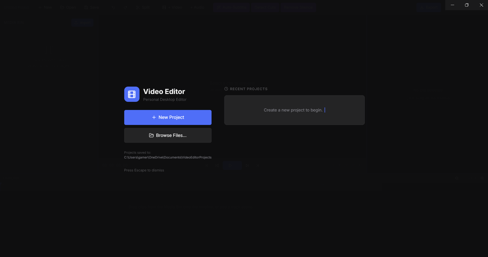
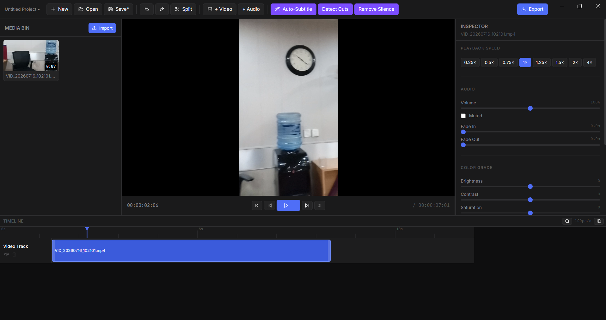

# Video Editor (`Hadeyosh`)

A personal desktop video editor I built because Adobe Premiere costs too much and I have trust issues with subscription software.

It's actually good though. Dark theme, timeline, preview, AI tools, the whole deal. Built with Electron so it's a real app and not another "just open it in Chrome" situation.




---

## What it does

- Import videos, audio, and images into a media bin
- Drag them onto a multi-track timeline
- Preview playback with scrubbing
- Trim clips, adjust speed, tweak volume
- Video effects: brightness, contrast, saturation, blur, opacity
- AI auto-subtitles powered by Whisper (runs locally, your footage stays on your machine)
- AI scene cut detection
- Export via FFmpeg
- Projects auto-save as `.vedit.json` files to `~/Documents/VideoEditorProjects`
- Recent projects screen on launch so you never lose track of what you were working on

---

## Stack

| Layer | Tech |
|---|---|
| Desktop shell | Electron |
| Frontend | React 18 + TypeScript + Vite |
| State | Zustand |
| Drag and drop | React DnD |
| Backend | FastAPI + Python |
| Video processing | FFmpeg |
| AI subtitles | faster-whisper |
| Scene detection | PySceneDetect |
| Database | SQLite via SQLModel |

---

## Project files

Projects are saved as `.vedit.json` files in:

```
Windows: C:\Users\YOU\Documents\VideoEditorProjects
Mac/Linux: ~/Documents/VideoEditorProjects
```

The folder gets created automatically the first time you hit Save. The JSON just stores references to your media file paths and your timeline state, so don't move your source videos around or the editor won't find them.

---

## Keyboard shortcuts

| Action | Shortcut |
|---|---|
| Save | Ctrl+S |
| Open | Ctrl+O |
| Undo | Ctrl+Z |
| Redo | Ctrl+Shift+Z |
| Split clip at playhead | S |
| Play / Pause | Space |
| Export | Ctrl+E |

---
## License

MIT. Do whatever you want with it. If you somehow make money off this I'm proud of you.
